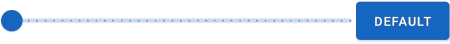

&nbsp;Delay until repeat... (ms)  

This option sets the amount of time between the first action and the second action (or the first repeat). This is part of the keyboard key behaviour simulation. If you want your repeating action to begin straight away, you can make this 0. 