This page aims to give users an introduction to the Key Mapper interface and a demonstration on how to perform typical tasks with the app.
For specific troubleshooting, consult the FAQ.

Where screenshots are necessary, this guide uses two devices to demonstrate.

1. OnePlus 7 Pro, Android 10, Dark theme, 1440p, tiny font size
2. Samsung J3 6, Android 5, Light theme, 720p, medium font size

App interface pictured: `keymapper-2.3.0-alpha-ci.715`

The guide is updated to match current stable release UI. [Report inaccuracies.](https://github.com/sds100/KeyMapper/issues/new)

## First time setup

When you open Key Mapper, you will be presented with this screen.
This screen is referred to as the Key Mapper home screen.

 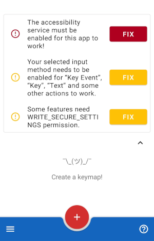

Tapping the FIX button next to the accessibility service prompt will allow you to grant Key Mapper permission to run its accessibility service. You must do this for the app to work at all.

You can then tap Key Mapper in your list of available services. There may be many others on this screen and your interface may be slightly different. If nothing happens when you tap FIX, or if you can't enable the service, see [this page](#) or ask for help in the [Discord server](http://keymapper.club).

 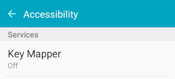

Tapping the FIX button next to the input method prompt will allow you to enable a Key Mapper compatible keyboard. If you want to perform actions like pressing keyboard keys or entering text you must enable this.

If you have only installed the Key Mapper app, your list of available keyboards will contain "Key Mapper Basic Input Method" only. If you aim to use a physical keyboard (not on-screen) when using Key Mapper, this will be suitable for you.

If you want an on-screen keyboard to be available while using Key Mapper, you need to install "Key Mapper GUI Keyboard". It is available on the [Google Play Store](http://gui.keymapper.club), [F-Droid](https://www.f-droid.org/en/packages/io.github.sds100.keymapper.inputmethod.latin/) and [GitHub](https://github.com/sds100/KeyMapperKeyboard/releases).

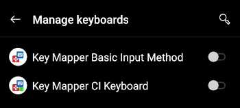 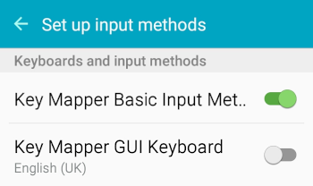

If you are using a Huawei or Xiaomi branded device, a device with 2GB of RAM or less, or intend to use the app while playing a mobile game, it is especially important to follow the next step.

Tapping the FIX button next to the battery optimisation prompt will allow you to turn off features of your device that may prevent Key Mapper's essential services from running in the background. This is usually the source of the common 'Key Mapper randomly stops working' issue.

Older devices (such as my Android 5 device pictured here) do not have this prompt in Key Mapper. However, I was still able to find the setting in my device settings app. Read more below for details.

The screen that opens after tapping FIX may vary depending on your device. In my case, to disable optimisation I found the app(s) in the list, tapped them to open their settings, and chose 'Don't optimise' and on the second device, 'Disabled'.

There is an excellent guide at [dontkillmyapp.com](http://dontkillmyapp.com) that explains how to disable battery and/or memory optimisation for your specific device. If Key Mapper randomly stops working even after you complete these steps, ask for help in [the Discord server.](http://keymapper.club)

 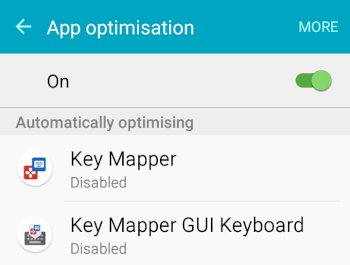

If you want to remap volume buttons and use them when Do Not Disturb is enabled, you should grant Key Mapper permission to do so. If you have an older device, you may not have this as an option.

Tapping FIX will allow you to grant the permission. Find Key Mapper in the list and tap it in order to choose 'Allowed'.

Most people can ignore the final prompt. If you want to create an action to change input method, you need to grant an additional set of permissions called WRITE_SECURE_SETTINGS. For help with this [click here.](http://docs.keymapper.club/user-guide/adb-permissions/#write_secure_settings)

## Creating a key map

A key map is an association between a user input (such as pushing a key or button) and a response from the device (sending information about what key was pressed and for how long).

In Key Mapper, 'user inputs' that are recognised by the app are called 'triggers'. The responses from your device that were due to a trigger being pressed are called 'actions'.

Key Mapper lets you assign actions to triggers that may be different from their default use. A 'volume-up' trigger normally increases the volume when pressed, but this app can change that to something else.

### Setting the trigger(s) and action(s)

To create your first key map, tap the + icon at the bottom of the Key Mapper home screen. You will see one of the two menus below.

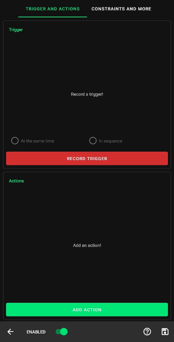 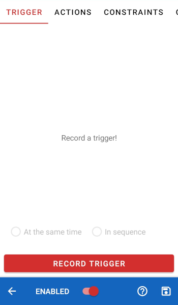

In either case, the first step is to record a trigger. Tap the red RECORD TRIGGER option and then press the physical button that you want to change the function of. In this guide I will demonstrate with Volume Down.

Key Mapper can also create a key map with multiple triggers. If you want to use more than one trigger for one key map, you can press the buttons in the order you will press them to execute the key map. For example, if you wanted to map 'Ctrl' + 'H' to show the device home menu, you should press 'Ctrl' and then 'H'.

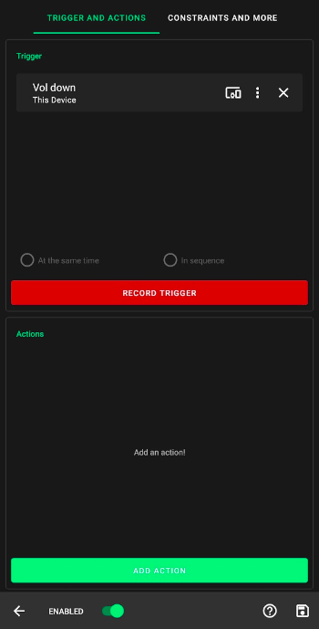 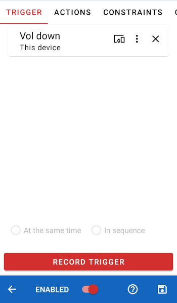

Next, it's time to choose an action. If you have a high-resolution display, you will see the ADD ACTION button at the bottom of the screen (pictured left). Otherwise, tap the ACTIONS tab at the top of the screen (pictured right).

 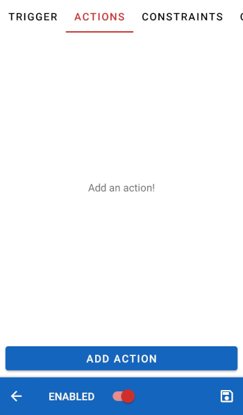

Tap the ADD ACTION button at the bottom of this screen. The action selection screen will open. Here you can choose from a wide variety of actions. Swipe left and right to change category, and scroll up and down the list until you find the action you want to add. Below is a table of the different kinds of actions you can choose from in each tab.

Tab | Description |
|-|-|
| App | Choose an app to open when you press your trigger. |
| App shortcut | Choose an app operation (such as sharing location, checking local traffic, sending a text message) |
| Keycode | Emulate a keyboard key press (such as an alphanumeric character or multimedia key) |
| System | Choose a system operation (such as toggling Bluetooth, opening the home menu, toggling flashlight) |
| Key | An alternative way to choose a key press action, by pressing the key that you want to map to. |
| Tap screen | Emulate a screen tap at a specific location on your screen. |
| Key event | Emulate a key press from a specifc connected device. |
| Text | Emulate typing a string. |
| Intent | See [this page.](http://docs.keymapper.club/user-guide/triggers/#trigger-by-intent-230) |
| Phone call | Call a telephone number. Network and carrier rates will apply. |
| Unsupported actions | A list of actions that your device won't allow you to use. Android frequently changes what users are allowed to do between versions. |

For this simple demonstration I will choose KEYCODE_E from the Keycode tab. This action will emulate pressing an E key on a keyboard.

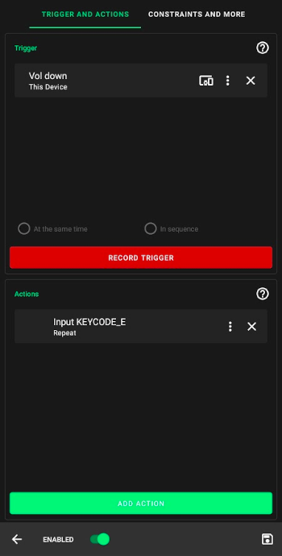 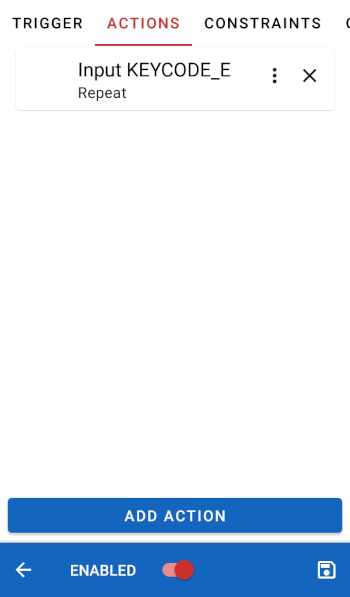

Key Mapper can also create a key map with multiple actions. If you want to add more actions to execute in series you can do so by tapping ADD ACTION again and choosing the next action in the chain. In the next section you can specify a delay between those actions if you wish.

### Customising the trigger(s) and action(s)

In the next section, I will explain in more detail how to customise your triggers and actions to be more in line with what you want. Most people will want to do at least some customisation.

Starting with the triggers, tap the 3 dot menu to the right of the trigger's name to bring up the following menu.

 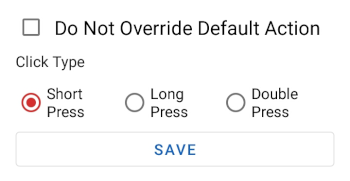 