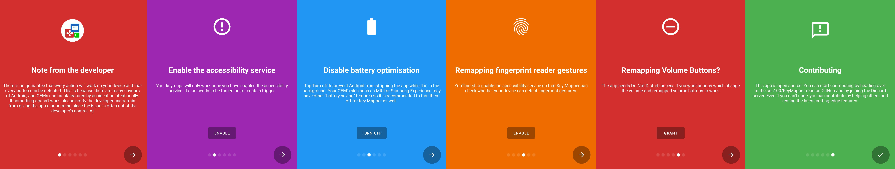

This page aims to give users an introduction to the Key Mapper interface and a demonstration on how to perform typical tasks with the app.
For specific troubleshooting, consult the FAQ.

Where screenshots are necessary, this guide uses two devices to demonstrate.

1. OnePlus 7 Pro, Android 11, Dark Theme, high resolution/dpi screen/1440p 16:9
2. Samsung J3, Android 8, Light Theme, typical resolution/dpi screen/720p 16:9

App interface pictured: `keymapper-2.3.0-alpha-ci.709`

The guide is updated to match current stable release UI. [Report inaccuracies.](https://github.com/sds100/KeyMapper/issues/new)

## First time setup

When Key Mapper is launched for the first time, a sequence of prompts are displayed.

For full functionality of the app, you should tap the ENABLE, TURN OFF, and GRANT buttons on the required screens.

Another opportunity to do the same thing is presented on the next screen. This screen is referred to as the *Key Mapper home screen*.

