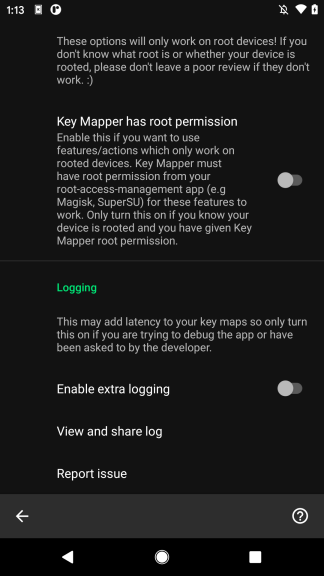

There is a button in the app that collects all the required information and walks through how to report an issue.

1. Enable "extra logging" in the Key Mapper settings. You can find it at the bottom of the settings page as shown below.

    ??? info "Screenshot"
        

2. Reproduce your issue. You must be able to make the bug happen again because otherwise we can't test that it has been fixed. 🙂

3. Tap the "report bug" button in the home screen menu as shown below. This will create a bug report zip file and help you send it to the developer.

    ??? info "Screenshot"
        
   
