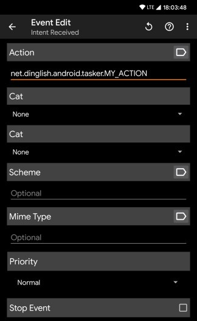

### Open app

Launch an app.

!!! warning "Extra permission on Xiaomi devices!"
    See issue [#1370](https://github.com/keymapperorg/KeyMapper/issues/1370). Xiaomi blocks apps from launching apps when they are in the background unless you give permission to "Display pop-up windows while running in the background" and "Display pop-up window". Follow these steps through the Settings app: Apps > Manage apps > Key Mapper App Settings > Other Permissions > Display pop-up windows while running in the background.

### Launch app shortcut

Launch an app shortcut. This is a great way to add more functionality to Key Mapper.

### Input key code

--8<-- "requires-key-mapper-keyboard-or-shizuku.md"

Input a simple key event with this key code.

### Tap screen (2.1.0+, Android 7.0+)

This will tap a point on your screen.

!!! warning
Android restricts what apps can do with this so you won't be able to tap the screen at the same time as Key Mapper and Key Mapper can't tap multiple places at once.

### Swipe screen (2.5.0+, Android 7.0+)

This will swipe from a start point to and end point on your screen. You can also setup the amount of "fingers" to simulate and the duration for the gesture, **but** this is limited due to your Android Version. 

See: [getMaxStrokeCount](https://developer.android.com/reference/android/accessibilityservice/GestureDescription#getMaxStrokeCount()) and [getMaxStrokeDuration](https://developer.android.com/reference/android/accessibilityservice/GestureDescription#getMaxGestureDuration()) for more information.

### Pinch screen (2.5.0+, Android 7.0+)

This will simulate a pinch gesture from a start point to and end point on your screen. You can choose between *pinch in* and *pinch out* and also the "pinch distance" for the pinch gesture. This is the distance between the start and the end point. The higher the distance, the stronger the pinch gesture, so you may want to start with a lower value for the pinch with max. 100. Later on you can adjust this by your needs, **but** the endpoints will never be less than 0 due to android restrictions.

You can also setup the amount of "fingers" to simulate and the duration for the gesture, **but** this is limited due to your Android Version. 

See: [getMaxStrokeCount](https://developer.android.com/reference/android/accessibilityservice/GestureDescription#getMaxStrokeCount()) and [getMaxStrokeDuration](https://developer.android.com/reference/android/accessibilityservice/GestureDescription#getMaxGestureDuration()) for more information.

### Input key event (2.1.0+)

--8<-- "requires-key-mapper-keyboard-or-shizuku.md"

This will input a more complicated key event than the simple key code action.

### Input text

--8<-- "requires-key-mapper-keyboard.md"

This will input any text that you want.

### Intent (2.3.0+)

This is a way to communicate with other apps, especially automation apps because they often have a way to trigger their own actions from an intent.

Read about intents in the Android SDK documentation [here](https://developer.android.com/reference/android/content/Intent).

#### Example 1

Opening the WiFi settings on the device. These are the only fields that you need to fill in...

- Description for Key Mapper = This can be anything you want because it is just for you to identify this action within the Key Mapper user interface.
- Select "Activity".

- Action = `android.settings.WIFI_SETTINGS`

#### Example 2

##### 1. Setting up the Tasker event

1. Select "Intent Received" event.
2. You only need to fill in the "Action" field. The action can be anything you want but since the action must be unique on the device it is recommended to start it with `net.dinglish.android.tasker`. In Key Mapper you will have to use the exact same action.
   

##### 2. Setting up Key Mapper

Send a broadcast to launch a Tasker action. These are the only fields that you need to fill in...

- Description for Key Mapper = This can be anything you want because it is just for you to identify this action within the Key Mapper user interface.
- Select "Broadcast receiver".

- Action = The exact same action that you used in Tasker. In my example this would be `net.dinglish.android.tasker.MY_ACTION`.

!!! attention "Launching Termux command intents"
You need to open the app info page for Key Mapper in your device settings and grant it the "run commands in termux environment" permission. On Android 12+ you must also turn off battery optimisation for Termux so that Android allows Termux to be started from the background.

### Phone call (2.3.0+)

This will start calling the number that you put.

### Play sound (2.4.0+)

This action will play a sound. Key Mapper will copy the sound file to its own folder, which means you won't have to worry about losing them. Key Mapper will only play one sound at a time and the sound will play forever until it stops or you pause your key maps. Your sounds will be backed up and restored with your key maps as well.

### Toggle/enable/disable WiFi

!!! attention "Requires ROOT permission on Android 10+"
If you aren't rooted then you must install the [WyFy](https://github.com/x13a/WyFy) app. You must then use the Intent action in Key Mapper to send a broadcast that tells this app to change the WiFi state. In the WyFy's README it outlines the Intent parameters. This app works around the issue by targeting API 28 (Android 9), which means the app doesn't need to follow the new restrictions in API 29 (Android 10). But this means it can't be approved in the Play Store so you must install the apk manually from GitHub or through F-Droid.

### Toggle/enable/disable Bluetooth  (up to Android 12L)

### Toggle/enable/disable mobile data

!!! attention "Requires ROOT permission"

### Toggle/enable/disable auto brightness

### Increase/decrease brightness

### Toggle/enable/disable auto-rotate

### Set screen to portrait/landscape

### Set screen orientation to 0°, 90°, 180° or 270°

### Cycle through screen orientations

### Volume up/down

### Mute/un-mute/toggle volume (Android 6.0+)

### Show volume popup

### Increase/decrease volume stream
This will increase or decrease a specific one of these volume streams.

- Alarm
- DTMF
- Music
- Notification
- Ring
- System
- Voice call
- Accessibility

### Cycle through ringer modes

### Change ringer mode

### Cycle between vibrate and ring

### Toggle/enable/disable do not disturb mode (Android 6.0+)

### Expand/toggle notification drawer

### Expand/toggle quick settings

### Collapse the status bar (up to Android 14)

### Play/pause/toggle media

### Next track

### Previous track

### Fast forward

### Rewind

### Go back

### Go home

### Open recent apps

### Toggle split screen (Android 7.0+)

### Go to the last app (Android 7.0+)

### Open menu

!!! attention "Deprecated in Key Mapper 3.0+"

### Toggle/enable/disable flashlight

In Key Mapper 3.0+ there is the option to also set a custom brightness. This is only supported on Android 13+ and on some devices.

### Change flashlight brightness (3.0+, Android 13.0+)

This is only supported on devices that let you change the flashlight brightness.

### Toggle/enable/disable NFC

!!! attention "Requires ROOT permission"

### Move cursor to the end of text

### Toggle/show/hide on-screen keyboard (Android 7.0+)

### Show keyboard picker (up to Android 9.0)

!!! attention "Requires ROOT permission on Android 8.1 and 9.0"

### Cut/copy/paste

### Select word at cursor

### Switch keyboard

### Toggle/enable/disable airplane mode

### Take screenshot

!!! attention "Requires ROOT permission on Android 8.1 and older"

### Open voice assistant

### Open device assistant

### Open camera app

### Open settings app

### Lock device

!!! attention "Requires ROOT permission on Android 8.1 and older"

### Secure lock device

This is different to 'lock device' because this will force you to unlock your device with your PIN or password and not with biometrics.

### Turn on/off device

!!! attention "Requires ROOT permission"

### Show power menu

### Answer/end phone call (2.4.0+)

If your phone is ringing then this action will answer the phone or if you are in a call then it will end it. Selecting
this action will automatically add the constraint to your key map when your device is ringing or is in a call
respectively.

!!! attention
    If you are using a volume button trigger with these actions then this key map will only work if you are using on of the Key Mapper keyboards! This is because Android doesn't tell accessibility services when the volume buttons are being pressed when your device is ringing or is in a phone call. But it does tell input methods when they are being pressed so you must use a Key Mapper keyboard that tells Key Mapper when the buttons are being pressed.

### Do nothing

### Dismiss all notifications (2.4.0+)

### Dismiss most recent notification (2.4.0+)

### HTTP Request (3.0.0+)