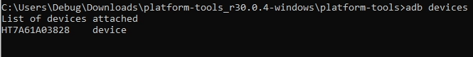

## Prepare ADB (Android Debug Bridge)

!!! tip "You might need to attempt this process multiple times because it can be flaky."

1. Enable developer options on your device by going to device Settings -> 'About Phone' and tapping 'Build Number' many times until it says you've enabled developer options. The location of the Build Number may vary between devices.

    ??? info "Screenshot"
        

2. Enable USB Debugging in developer options and plug your device into your PC.

    ??? info "Screenshot"
        

3. Download the [Android SDK platform tools](https://developer.android.com/studio/releases/platform-tools.html) from here and unzip it.

4. Open a terminal/command prompt in the unzipped folder.

5. Type or paste in a terminal: `adb devices` and your device then click the prompt on your phone to allow USB debugging from your PC.

    ??? info "Prompt on phone"
        

6. Type `adb devices` again and make sure you see the correct output as shown below.

    ??? success "Correct command prompt output"
        

    ??? failure "Incorrect command prompt outputs"
        
        
        

## WRITE_SECURE_SETTINGS

There are 3 ways to grant this permission.

- Use Shizuku (Key Mapper 2.4.0+ only). This is recommended on all devices running Android 11 and
  newer. This requires some setting up. Read the guide [here](shizuku.md).

- If your device is **rooted**, Key Mapper can grant itself these permissions by enabling the "Key
  Mapper has root permission" toggle in the Key Mapper settings.

- If your device is **not rooted** and you don't want to use Shizuku you must do the following...

    1. Follow the "Prepare ADB" guide at the top of this page.

    2. Type or paste in a terminal:

    ```
    adb shell pm grant io.github.sds100.keymapper android.permission.WRITE_SECURE_SETTINGS
    ```

    !!! attention
        For CI builds (the app icon with a green square) the package name is `io.github.sds100.keymapper.ci`. For Debug builds (the app icon with a yellow square) the package name is `io.github.sds100.keymapper.debug`.

  These permissions persist across reboots but need to be granted again if the app is reinstalled.

## Enabling the Accessibility Service

You may wish to enable Key Mapper's accessibility service using ADB if you cannot do so in-app due
to manufacturer constraints.

!!! tip
    It is recommended to also follow the instructions to grant the WRITE_SECURE_SETTINGS permission
    on this page so Key Mapper can start and stop the accessibility service itself.

1. Follow the "Prepare ADB" guide at the top of this page.

2. To add Key Mapper to the List of the enabled accessibility providers, type or paste in a
   terminal:

    ```
    adb shell settings put secure enabled_accessibility_services io.github.sds100.keymapper/io.github.sds100.keymapper.service.MyAccessibilityService
    ```