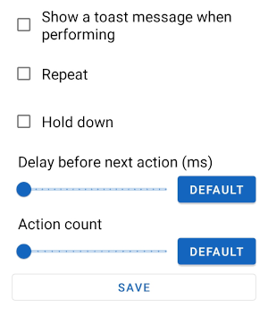

Refer to the [Quick Start Guide](../quick-start.md) for help with creating key maps. This page gives more detail about every option.

Make sure to save :fontawesome-solid-save: your key map after applying these changes.

## Trigger

A trigger is a combination of keys that must be pressed in a certain way to 'trigger' the key map. A key map can only have one trigger. You can change the order of the keys by holding down on one and then dragging it into a new position.
 
This is the page to create a trigger for a key map.


### Trigger modes

A trigger with one key doesn't have a mode. Triggers with more than one key can be one of two trigger modes: 'parallel' and 'sequence'. The button for a parallel trigger says 'at the same time' because this is more descriptive. The plus symbol between the keys will change to an arrow if the trigger is a sequence trigger. The developer has called them "parallel" triggers because you press it is one word and you press the keys in parallel.

#### Parallel

You must press the keys down at the same time to trigger the key map and the must be pressed down in the order as displayed from top to bottom. E.g For the trigger screenshot you must press volume up first and then volume down and not the other away around.

#### Sequence

You must press the keys down and up one after another to trigger the key map in a specified amount of time. This timeout is 1000ms by default and this default can be changed in the app [settings](settings.md). You can change the timeout for a specific key map by going to the options page for the key map as explained further down this page.

### Key click type

There are 3 click types: short press, long press and double press.

Parallel triggers can only be short pressed or long pressed. The click type can be customised for each key in a sequence trigger by pressing on the 3 dot :fontawesome-solid-ellipsis-v: button on each key.

#### Short press

This is a simple press of the key and there are no restrictions to how you press it. The key map is triggered when this key is pressed down and doesn't need to be released to activate it. There are no options for this click type.

#### Long press

You need to hold down the key for at least some amount of time for it to trigger the key map. This is 500ms by default and this default can be changed in the app [settings](settings.md).  You can change the long press delay for all keys in a key map by going to the options page for the key map as explained further down this page.

#### Double press

You need to press down and release the key in rapid succession for it to trigger the key map. You must do this within 300ms by default and this default can be changed in the app [settings](settings.md).  You can change the double press timeout for all keys in a key map by going to the options page for the key map as explained further down this page.

### Key device

Tap the :devices: button on a key so that Key Mapper only detects the key when it comes from a specific device. The default device is 'this device', which means the Android device that you've installed Key Mapper on.

External devices are only listed if they are connected to your Android device when you configure the key map. If you have multiple devices with the same name then turn on the setting to show the first 5 characters of the device ID in the app [settings](settings.md). This will help you distinguish between them.

### Key options


This menu pops up if you press the 3 dot :fontawesome-solid-ellipsis-v: button on a key.

#### Do not override default action

--8<-- "trigger-options/dont-override-default-action.md"

#### Click type

This will change the click type for a key in a sequence trigger. A parallel trigger key will not have the click type option because all the keys have the same click type. You will find the buttons to change a parallel trigger's click type above the trigger mode buttons as shown in the image at the top of this Trigger section.

## Customising actions

You can tap the 3 stacked dots :fontawesome-solid-ellipsis-v: to the right of the action's name to bring up the following menu.

 

Here you can customise a lot of the operation of your key map, including timing and multipliers.
___

--8<-- "action-options/delay-before-next-action.md"
___

--8<-- "action-options/action-count.md"
___

#### Repeating actions

--8<-- "action-options/repeat.md"
___

--8<-- "action-options/repeat-every.md"
___

--8<-- "action-options/delay-until-repeat.md"
___

--8<-- "action-options/repeat-limit.md"
___

<sup><sub>&nbsp;Stop repeating when...</sup></sub><br />
&nbsp;&nbsp;&nbsp;:radiobox-marked:{: .accent-light } <sup><sub>Trigger is released</sup></sub>&nbsp;&nbsp;&nbsp;&nbsp;&nbsp;&nbsp;&nbsp;&nbsp;&nbsp;&nbsp;&nbsp;&nbsp;&nbsp;&nbsp;&nbsp;&nbsp;&nbsp;&nbsp;&nbsp;&nbsp;&nbsp;&nbsp;&nbsp;:radiobox-marked:{: .accent-light } <sup><sub>Trigger is pressed again</sup></sub>&nbsp;&nbsp;&nbsp;&nbsp;&nbsp;&nbsp;&nbsp;&nbsp;&nbsp;&nbsp;&nbsp;&nbsp;&nbsp;&nbsp;&nbsp;&nbsp;&nbsp;&nbsp;&nbsp;&nbsp;&nbsp;&nbsp;&nbsp;:radiobox-marked:{: .accent-light } <sup><sub>Limit reached</sup></sub>

- **Trigger is released**. You will need to hold down the trigger in order for the keys to repeat. If you let go of the trigger, the repeating will stop.

- **Trigger is pressed again**. Pressing your trigger once will be sufficient to start your repeating key map. To stop the key map, you will need to press the trigger a second time.

- **Limit reached**. (Key Mapper 2.3.0+). Your key map will stop repeating once the limit has been reached regardless of whether the trigger is being held down.

#### Hold down actions

--8<-- "action-options/hold-down.md"
___

--8<-- "action-options/hold-down-behaviour.md"

#### Using 'Hold down' and 'Repeat' together

--8<-- "action-options/using-hold-down-and-repeat-together.md"

## Special options

There are options for a key map under the 'Options' or 'Constraints and more' tab. Here are explanations of each option.

### Trigger from other apps (2.3.0+)


This allows you to trigger the key map by using a shortcut or by sending an [Intent](https://developer.android.com/reference/android/content/Intent) to Key Mapper. Turning this off will stop any shortcuts or Intents for this key map from working.

#### Home screen (launcher) shortcut

You can create a home screen shortcut by tapping "create launcher shortcut" or by adding the shortcut to your home screen in the same way as a widget. You can also use this shortcut from automation apps like Tasker and Automate without having to create a home screen shortcut.

#### Intent

There are many apps that can automate broadcasting Intents such as Tasker and Automate.

##### Intent action

```
io.github.sds100.keymapper.ACTION_TRIGGER_KEYMAP_BY_UID
```

##### Intent string extra 

```
io.github.sds100.keymapper.EXTRA_KEYMAP_UID
```

The extra value is the UUID of the key map. You can copy the UUID in Key Mapper by turning on the "Trigger from other apps" option.

---

--8<-- "trigger-options/on-screen-message.md"

You can have your device vibrate instead of an on-screen message if you want. This option is below.

---

--8<-- "trigger-options/vibrate.md"

--8<-- "trigger-options/long-press-double-vibration.md"

This behaves similarly to the on-screen message option above.

---

--8<-- "trigger-options/trigger-when-screen-off.md"

---

--8<-- "trigger-options/long-press-delay.md"

---

--8<-- "trigger-options/double-press-delay.md"

---

--8<-- "trigger-options/sequence-trigger-timeout.md"

## Adding constraints

--8<-- "configuring-constraints.md"