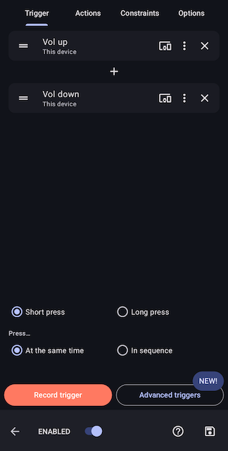
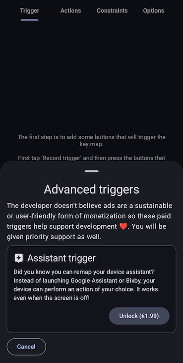
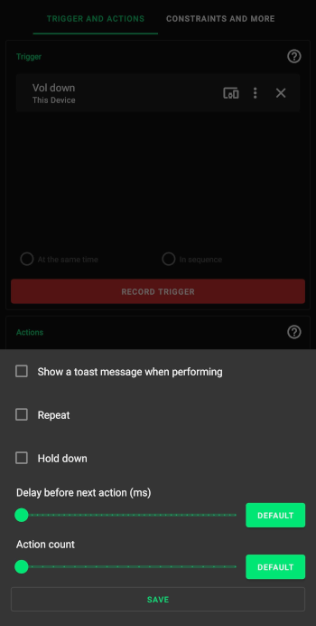

Refer to the [Quick Start Guide](../quick-start.md) for help with creating key maps. This page gives more detail about every option.

Make sure to save :material-content-save: your key map after applying these changes.

## Trigger

A trigger is a combination of keys that must be pressed in a certain way to 'trigger' the key map. A key map can only have one trigger. You can change the order of the keys by holding down on one and then dragging it into a new position.
 
This is the page to create a trigger for a key map. You will usually want to 'record' a custom trigger that is a combination of physical buttons/keys. There are also ['advanced triggers'](#advanced-triggers) that need to be set up slightly differently.



### Trigger modes

A trigger with one key doesn't have a mode. Triggers with more than one key can be one of two trigger modes: 'parallel' and 'sequence'. The button for a parallel trigger says 'at the same time' because this is more descriptive. The plus symbol between the keys will change to an arrow if the trigger is a sequence trigger. The developer has called them "parallel" triggers because you press it is one word and you press the keys in parallel.

#### Parallel

You must press the keys down at the same time to trigger the key map and the must be pressed down in the order as displayed from top to bottom. E.g For the trigger screenshot you must press volume up first and then volume down and not the other away around.

#### Sequence

You must press the keys down and up one after another to trigger the key map in a specified amount of time. This timeout is 1000ms by default and this default can be changed in the app [settings](settings.md). You can change the timeout for a specific key map by going to the options page for the key map as explained further down this page.

### Key click type

There are 3 click types: short press, long press and double press.

Parallel triggers can only be short pressed or long pressed. The click type can be customised for each key in a sequence trigger by pressing on the 3 dot :material-dots-vertical: button on each key.

#### Short press

This is a simple press of the key and there are no restrictions to how you press it. The key map is triggered when this key is pressed down and doesn't need to be released to activate it. There are no options for this click type.

#### Long press

You need to hold down the key for at least some amount of time for it to trigger the key map. This is 500ms by default and this default can be changed in the app [settings](settings.md).  You can change the long press delay for all keys in a key map by going to the options page for the key map as explained further down this page.

#### Double press

You need to press down and release the key in rapid succession for it to trigger the key map. You must do this within 300ms by default and this default can be changed in the app [settings](settings.md).  You can change the double press timeout for all keys in a key map by going to the options page for the key map as explained further down this page.

### Key device

Tap the :devices: button on a key so that Key Mapper only detects the key when it comes from a specific device. The default device is 'this device', which means the Android device that you've installed Key Mapper on.

External devices are only listed if they are connected to your Android device when you configure the key map. If you have multiple devices with the same name then turn on the setting to show the first 5 characters of the device ID in the app [settings](settings.md). This will help you distinguish between them.

### Key options


This menu pops up if you press the 3 dot :material-dots-vertical: button on a key.

#### Do not remap

--8<-- "trigger-options/dont-override-default-action.md"

This option doesn't remap the trigger key, which means it will continue do its normal thing when clicked as well as your
action. This will be automatically

#### Click type

This will change the click type for a key in a sequence trigger. A parallel trigger key will not have the click type
option because all the keys have the same click type. You will find the buttons to change a parallel trigger's click
type above the trigger mode buttons as shown in the image at the top of this Trigger section.

## Advanced triggers

These triggers can be purchased so that the Key Mapper project has a little financial support and the developer is able to invest time maintaining and working on the project. You can see the list of advanced triggers below by tapping 'advanced triggers' on the trigger page.

{ width="200" }

### Floating buttons

Read about floating buttons [here](floating-buttons.md).

### Side key & Assistant trigger

This trigger allows you to remap the various ways that your device can trigger the side key or assistant.

!!! danger
    Key Mapper can not walk you through setting this trigger up because the steps are unique to almost every device and Android skin. **You must read the instructions below.**

There are 2 options you can choose to configure how the trigger works.

- **Side key/power button**: The key map will be triggered whenever the "Key Mapper: Side key" app is launched. Read more in the next section on how to set this up on some devices.
- **Voice assistant**: This is the assistant launched from the hands-free voice button on keyboards/headsets. When you launch the voice assistant, your device should ask you which app to use by default and you should see Key Mapper in that list.

!!! note
    It is not possible to create long-press key maps with this trigger! But you can do double press. You also can not use multiple assistant triggers in a parallel trigger because there is no way to detect them being pressed at exactly the same time.

**Long press power button, Pixel squeeze**

Most stock Android devices have this option. In your settings app you should have the option to remap a long press of the power button to the assistant app. Older Pixels, such as the Pixel 2, also have a feature called "Active Edge" that allowed you to _squeeze_ the bottom half of the phone to trigger the assistant. If you select Key Mapper as the default 'digital assistant' app then your key map will be triggered with both of these methods.

You can set up the long-press of the power button by going to Android Settings :material-arrow-right-thin: System :material-arrow-right-thin: Gestures :material-arrow-right-thin: Press and hold power button. Then choose the digital assistant instead of showing the power menu when you long press the power button.

**Samsung side key/Bixby button**

This *should* work on Samsung devices that have a dedicated side key button but also devices that have the option of remapping the power button to another app when you long or double press it. You can use the assistant trigger for double pressing the Bixby or power button by picking the 'Key Mapper: Side key' app that shows in your list of apps.

**Voice assistant button on keyboards and Bluetooth headphones**

Many external devices such as headsets and keyboards have a button for launching the voice assistant so you can control your phone hands-free. This also works with Key Mapper. 

!!! warning
    Some headphones have hardcoded the assistant apps that they support and will not work with Key Mapper. The developer has Sony WH1000XM3 headphones that only support Alexa and Google Assistant and refuse to launch Key Mapper when it is selected as the default assistant app.

**Help 😱! None of these steps work on my device**

!!! question
    You will need to search in your device settings or on the internet for how to remap the side key/power button on your device. If you're still stuck you can contact the developer in the app with the 'Contact developer' button shown in [this](keymaps.md#advanced-triggers) screenshot. _You **must** fill in the template otherwise we will ignore the email._

## Customising actions

You can tap the pencil icon :material-pencil-outline: to the right of the action's name to bring up the following menu.



Here you can customise a lot of the operation of your key map, including timing and multipliers. There are two buttons to 'replace' and 'edit' the action. The 'edit' button isn't shown for all actions because you can't configure what they do.
___

--8<-- "action-options/delay-before-next-action.md"
___

--8<-- "action-options/action-count.md"
___

#### Repeating actions

--8<-- "action-options/repeat.md"
___

--8<-- "action-options/repeat-every.md"
___

--8<-- "action-options/delay-until-repeat.md"
___

--8<-- "action-options/repeat-limit.md"
___

<sup><sub>&nbsp;Stop repeating when...</sup></sub><br />
&nbsp;&nbsp;&nbsp;:radiobox-marked:{: .accent-light } <sup><sub>Trigger is released</sup></sub>&nbsp;&nbsp;&nbsp;&nbsp;&nbsp;&nbsp;&nbsp;&nbsp;&nbsp;&nbsp;&nbsp;&nbsp;&nbsp;&nbsp;&nbsp;&nbsp;&nbsp;&nbsp;&nbsp;&nbsp;&nbsp;&nbsp;&nbsp;:radiobox-marked:{: .accent-light } <sup><sub>Trigger is pressed again</sup></sub>&nbsp;&nbsp;&nbsp;&nbsp;&nbsp;&nbsp;&nbsp;&nbsp;&nbsp;&nbsp;&nbsp;&nbsp;&nbsp;&nbsp;&nbsp;&nbsp;&nbsp;&nbsp;&nbsp;&nbsp;&nbsp;&nbsp;&nbsp;:radiobox-marked:{: .accent-light } <sup><sub>Limit reached</sup></sub>

- **Trigger is released**. You will need to hold down the trigger in order for the keys to repeat. If you let go of the trigger, the repeating will stop.

- **Trigger is pressed again**. Pressing your trigger once will be sufficient to start your repeating key map. To stop the key map, you will need to press the trigger a second time.

- **Limit reached**. (Key Mapper 2.3.0+). Your key map will stop repeating once the limit has been reached regardless of whether the trigger is being held down.

#### Hold down actions

--8<-- "action-options/hold-down.md"
___

--8<-- "action-options/hold-down-behaviour.md"

#### Using 'Hold down' and 'Repeat' together

--8<-- "action-options/using-hold-down-and-repeat-together.md"

## Special options

There are options for a key map under the 'Options' or 'Constraints and more' tab. Here are explanations of each option.

### Allow other apps to trigger this key map (2.3.0+)


This allows you to trigger the key map by using a shortcut or by sending an [Intent](https://developer.android.com/reference/android/content/Intent) to Key Mapper. Turning this off will stop any shortcuts or Intents for this key map from working.

#### Home screen (launcher) shortcut

You can create a home screen shortcut by tapping "create launcher shortcut" or by adding the shortcut to your home screen in the same way as a widget. You can also use this shortcut from automation apps like Tasker and Automate without having to create a home screen shortcut.

!!! note
    This button will be disabled if your launcher doesn't let 3rd party apps tell it to create shortcuts so you'll have to create it manually.

#### Intent

There are many apps that can automate broadcasting Intents such as Tasker and Automate.

##### Intent action

```
io.github.sds100.keymapper.ACTION_TRIGGER_KEYMAP_BY_UID
```

##### Intent string extra

```
io.github.sds100.keymapper.EXTRA_KEYMAP_UID
```

The extra value is the UUID of the key map. You can copy the UUID in Key Mapper by turning on the "Trigger from other apps" option.

##### Intent package name

The component for the intent must be sent so that the intent is sent specifically to Key Mapper and not any other apps. Android enforces this and will not send the intent to Key Mapper if it is not specified. If you are using a .debug or .ci build then add .debug or .ci to the end of the package name below only and **not** the class name.

```bash
io.github.sds100.keymapper/io.github.sds100.keymapper.api.TriggerKeyMapsBroadcastReceiver
```

#### ADB command

This adb command tests this feature.

```bash
adb shell am broadcast -n io.github.sds100.keymapper/io.github.sds100.keymapper.api.TriggerKeyMapsBroadcastReceiver -a io.github.sds100.keymapper.ACTION_TRIGGER_KEYMAP_BY_UID --es io.github.sds100.keymapper.EXTRA_KEYMAP_UID $KEYMAP_UID$
```

---

--8<-- "trigger-options/on-screen-message.md"

You can have your device vibrate instead of an on-screen message if you want. This option is below.

---

--8<-- "trigger-options/vibrate.md"

--8<-- "trigger-options/long-press-double-vibration.md"

This behaves similarly to the on-screen message option above.

---

--8<-- "trigger-options/trigger-when-screen-off.md"

---

--8<-- "trigger-options/long-press-delay.md"

---

--8<-- "trigger-options/double-press-delay.md"

---

--8<-- "trigger-options/sequence-trigger-timeout.md"

## Adding constraints

--8<-- "configuring-constraints.md"