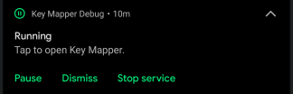

--8<-- "go-to-settings.md"

## Dark theme
Should be self explanatory. 🌚

## Automatically back up mappings
Tapping this setting will allow to choose a location to automatically back up your mappings to.

## Hide home screen alerts
This will hide the alerts at the top of the home screen.

## Force vibrate
This will make all your mappings vibrate when they are triggered

## Show the first 5 characters of the device id for device specific triggers
Whenever you see the name of a device in Key Mapper like in your triggers, it will append the first 5 characters of the unique identifier for the device at the end of its name. This is useful because some external devices are reported to Android as multiple devices but have the same name.

## Pause/resume mappings notification

This is a useful notification so you can easily pause and resume your key maps.

## Default mapping options

These settings allow you to change the defaults for these key map options. For example if the 'long press delay' for a key map is set to 'default' changing this setting will affect that key map.

## Delete sound files

Tapping this will let you delete sound files that are being used by sound actions.

## Shizuku support

Read more about this [here](shizuku.md).

## Automatically change the on-screen keyboard when you start typing (2.4.0+)

!!! attention
    You must [grant Key Mapper WRITE_SECURE_SETTINGS permission](../adb-permissions/#write_secure_settings) for this to notification to be shown. Alternatively on Android 11+ you can just turn on the accessibility service.

Your normal keyboard will be automatically selected when you try to start typing and your Key Mapper keyboard will be selected when you close the keyboard.

## Automatically change the on-screen keyboard when a device connects/disconnects

!!! attention
    You must [grant Key Mapper WRITE_SECURE_SETTINGS permission](../adb-permissions/#write_secure_settings) for this to notification to be shown. Alternatively on Android 11+ you can just turn on the accessibility service.

!!! info
    This is restricted to Bluetooth devices in Key Mapper 2.2.0 and older. After updating to Key Mapper 2.3.0 you will need to set this up again because the data for the Bluetooth devices can't be migrated in a way that the new feature will work.

The last used Key Mapper keyboard will be automatically selected when a chosen device is connected. Your normal keyboard will be automatically selected when the device disconnects.

## Automatically change the on-screen keyboard when toggling key maps

!!! attention
    You must [grant Key Mapper WRITE_SECURE_SETTINGS permission](../adb-permissions/#write_secure_settings) for this to notification to be shown. Alternatively on Android 11+ you can just turn on the accessibility service.

The last used Key Mapper keyboard will be automatically selected when you unpause your key maps. Your normal keyboard will be automatically selected when they are paused.

## Toggle Key Mapper keyboard notification

!!! attention
    You must [grant Key Mapper WRITE_SECURE_SETTINGS permission](../adb-permissions/#write_secure_settings) for this to notification to be shown. Alternatively on Android 11+ you can just turn on the accessibility service.

This notification will select the last used Key Mapper keyboard if you are using your normal keyboard and will select your normal keyboard if the Key Mapper keyboard is being used.

## Automatically show keyboard picker (up to Android 9.0)

!!! attention
    This requires ROOT permission on Android 8.1 and Android 9.0 because Android blocked the ability for apps to show the input method picker when they are running in the background. Android removed the ability to show this even with ROOT on versions later than Android 9.0.

!!! info
    This is restricted to Bluetooth devices in Key Mapper 2.2.0 and older. After updating to Key Mapper 2.3.0 you will need to set this up again because the data for the Bluetooth devices can't be migrated in a way that the new feature will work.

When a device that you have chosen connects or disconnects the keyboard picker will show automatically. Choose the devices below.

## Key Mapper has root permission

!!! error "Don't turn this on if you don't know what 'rooting' is."
    Read more [here](https://en.wikipedia.org/wiki/Rooting_(Android)).

This setting needs to be turned on for some features in Key Mapper to work. You **must** grant Key Mapper root permission in your root management app (e.g Magisk, SuperSU) before you turn this on.

## Fix keyboards that are set to US English (2.3.0+, Android 11+)

!!! info
    See the Android 11 bug on Google's issue tracker [here](https://issuetracker.google.com/issues/163120692).

    There is a bug in Android 11 that turning on an accessibility service makes Android think all external devices are the same internal virtual device. Because it can\'t identify these devices correctly, it doesn\'t know which keyboard layout to use with them so it defaults to US English even if it is a German keyboard for example.

!!! warning
    This feature **will not fix game controllers** because joysticks and triggers send *motion* events and not *key* events.

Steps to work around this bug...

1. Enable the Key Mapper accessibility service.
2. 
 --8<-- "go-to-settings.md"

3. Scroll down to the 'Workaround for Android 11 bug that sets the device id for input events to -1' setting and turn it on.
4. **To avoid confusion and headaches** read about how input methods work with Key Mapper [here](key-mapper-keyboard.md).
5. Tap 'Enable the Key Mapper keyboard' and turn on the Key Mapper GUI Keyboard or the Key Mapper Basic Input Method.
6. Tap 'Use the Key Mapper keyboard' and select the keyboard that you just enabled.
   It is recommended that you setup the setting to automatically change the on-screen keyboard when the device connects and disconnects. You can find this further up this page. This is useful if you don't want to use one of the Key Mapper keyboards all the time. If you want to change the keyboard manually then see [this](../faq.md#how-do-i-change-the-keyboard) question in the faq.

7. Connect the device that you want to fix to your Android device.
8. Tap 'Choose devices' and select the devices that should be fixed.
9. Your keyboard layout should be fixed! 🎉 If you're having issues checkout the FAQ below or [join](http://www.keymapper.club) the Discord server.

!!! faq
    - Can I use a non Key Mapper keyboard like Gboard instead? No because Key Mapper isn't allowed to tell other input methods what to type.
    - Can I add support for joysticks and triggers? No because Android doesn't allow apps to input motion events to other apps.

## Logging (2.3.0+)

This is very useful for debugging and can be used instead of a bug report. Read about how to send this information to the developer [here](../report-issues.md). Some things like app crashes always save to the log regardless of whether extra logging is turned on.

You can find the button to open the log at the bottom of the Key Mapper settings. This is what it looks like.

!!! warning
    Extra logging should only be turned on if you are trying to fix an issue or have been told to by the developer otherwise Key Mapper will use more storage space and your key maps might have higher latency. Turn this off once you have fixed the issue or have gathered the information that you need.

Tap on 'View and share log' to be able to see and share the log.

There are buttons at the bottom of the screen to...

- Copy the log to the clipboard.
- Save the log to a file.
- Clear the log.
- Toggle short messages on and off. This only affects the logging screen in the app and doesn't affect how the log is copied or saved.